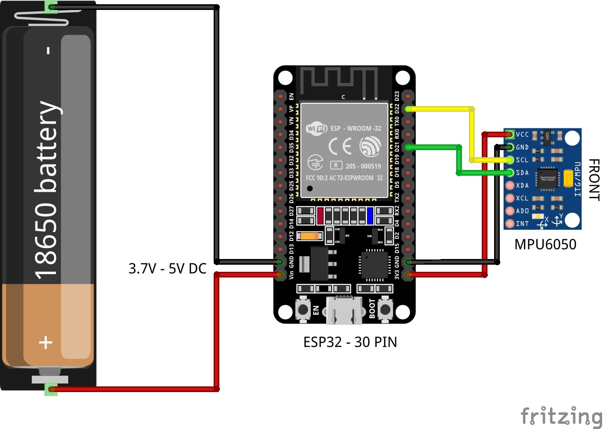
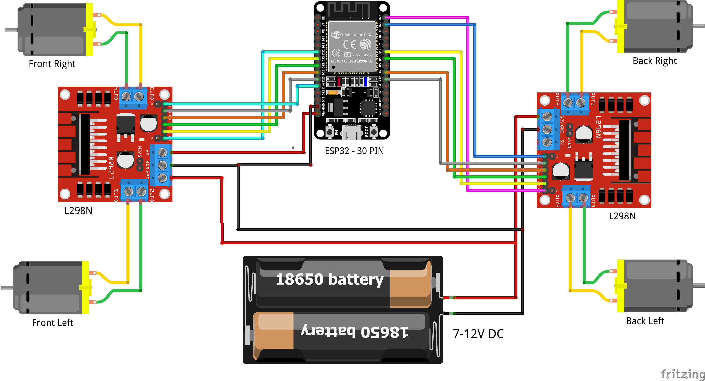

# 🚗 ESP32 Gesture Control Robot Car

โปรเจกต์หุ่นยนต์รถ 4 ล้อ (4WD Robot Car) ควบคุมไร้สายด้วยท่าทางมือ (Gesture Control) ผ่านโปรโตคอล **ESP-NOW** ที่มีความเร็วสูงและ Latency ต่ำ โดยใช้ไมโครคอนโทรลเลอร์ **ESP32** ร่วมกับเซนเซอร์วัดความเอียงและความเร่ง **MPU6050 (6-Axis IMU)**

---

## 📁 โครงสร้างโปรเจกต์ (Project Structure)

```text
ชิ้นงาน/
├── docs/                                  # เอกสารและวงจรการต่อสาย
│   └── schematics/
│       ├── transmitter_schematic.png      # แผนผังวงจรตัวส่ง (Glove / Transmitter)
│       └── receiver_schematic.png         # แผนผังวงจรตัวรับ (Robot Car / Receiver)
├── src/                                   # โค้ดโปรแกรม (Arduino Sketches)
│   ├── transmitter/                       # สเก็ตช์สำหรับตัวส่ง (รีโมตควบคุมถุงมือ)
│   │   └── transmitter.ino
│   ├── receiver/                          # สเก็ตช์สำหรับตัวรับ (บอร์ดควบคุมรถยนต์)
│   │   └── receiver.ino
│   └── tools/                             # เครื่องมือเสริม
│       └── get_mac_address/               # สเก็ตช์สำหรับอ่านค่า MAC Address
│           └── get_mac_address.ino
├── .gitignore
└── README.md
```

---

## 🛠️ อุปกรณ์ที่ใช้ (Hardware Components)

### ฝั่งตัวส่ง (Transmitter / Glove Controller)
1. บอร์ด **ESP32 Development Board** (NodeMCU-32S / WROOM-32)
2. โมดูลเซนเซอร์ **MPU6050** (Gyroscope + Accelerometer)
3. แบตเตอรี่จ่ายไฟ (เช่น 18650 หรือ LiPo 3.7V - 5V)
4. สวิตช์เปิด-ปิด และถุงมือ/สายรัดข้อมือ

### ฝั่งตัวรับ (Receiver / Robot Car)
1. บอร์ด **ESP32 Development Board**
2. โมดูลขับมอเตอร์ **L298N** (หรือ 4-Channel Motor Driver)
3. ชุดโครงรถ 4WD พร้อมมอเตอร์ DC Gear Motor x 4 ตัว
4. แหล่งจ่ายไฟสำหรับมอเตอร์ (เช่น แบตเตอรี่ 2S/3S 7.4V - 12V) พร้อมวงจร Step-down (Buck Converter) จ่ายไฟ 5V ให้ ESP32

---

## 🔌 ตารางการต่อสาย (Wiring & Pinout)

### 1. วงจรตัวส่ง (Transmitter Pinout)
| MPU6050 Pin | ESP32 GPIO | คำอธิบาย |
| :--- | :--- | :--- |
| **VCC** | `3V3` หรือ `5V` | ไฟเลี้ยงเซนเซอร์ |
| **GND** | `GND` | กราวด์ร่วม |
| **SCL** | `GPIO 22` | I2C Clock |
| **SDA** | `GPIO 21` | I2C Data |



---

### 2. วงจรตัวรับ (Receiver Pinout)
| มอเตอร์ | ขาบนไดรเวอร์ | ESP32 GPIO | PWM Channel |
| :--- | :--- | :--- | :--- |
| **Back Right Motor** | IN1, IN2, ENA | `GPIO 16`, `GPIO 17`, `GPIO 22` | Channel 4 |
| **Back Left Motor** | IN3, IN4, ENB | `GPIO 18`, `GPIO 19`, `GPIO 23` | Channel 5 |
| **Front Right Motor** | IN1, IN2, ENA | `GPIO 26`, `GPIO 27`, `GPIO 14` | Channel 6 |
| **Front Left Motor** | IN3, IN4, ENB | `GPIO 33`, `GPIO 25`, `GPIO 32` | Channel 7 |



---

## 📦 ไลบรารีที่จำเป็น (Required Libraries)

สำหรับการคอมไพล์โค้ดใน **Arduino IDE**:
1. **ESP32 Board Package**: เพิ่ม `https://raw.githubusercontent.com/espressif/arduino-esp32/gh-pages/package_esp32_index.json` ใน Additional Board URLs
2. **I2Cdevlib / MPU6050**: ติดตั้งผ่าน Library Manager หรือนำเข้าจาก [jrowberg/i2cdevlib](https://github.com/jrowberg/i2cdevlib)

---

## 🚀 ขั้นตอนการติดตั้งและใช้งาน (Getting Started)

### ขั้นตอนที่ 1: หาค่า MAC Address ของบอร์ดตัวรับ (Receiver)
1. เปิดไฟล์ `src/tools/get_mac_address/get_mac_address.ino`
2. อัปโหลดลงบน **ESP32 ฝั่งตัวรับ (บอร์ดติดรถ)**
3. เปิด **Serial Monitor** ที่ Baud Rate `115200`
4. คัดลอกค่า MAC Address ที่แสดง (เช่น `B0:A7:32:2A:5B:0C`)

### ขั้นตอนที่ 2: ตั้งค่าและอัปโหลดโค้ดตัวส่ง (Transmitter)
1. เปิดไฟล์ `src/transmitter/transmitter.ino`
2. นำค่า MAC Address ที่ได้จากขั้นตอนที่ 1 ไปใส่ในบรรทัดที่ 20:
   ```cpp
   uint8_t receiverMacAddress[] = {0xB0, 0xA7, 0x32, 0x2A, 0x5B, 0x0C};
   ```
3. อัปโหลดโค้ดลงบน **ESP32 ฝั่งถุงมือควบคุม**

### ขั้นตอนที่ 3: อัปโหลดโค้ดตัวรับ (Receiver)
1. เปิดไฟล์ `src/receiver/receiver.ino`
2. อัปโหลดโค้ดลงบน **ESP32 ฝั่งตัวรถ**

---

## 🎮 การควบคุมท่าทาง (Gesture Controls)

| ท่าทางมือ (Hand Gesture) | ทิศทางการเคลื่อนที่ของรถ |
| :--- | :--- |
| **เอียงมือไปข้างหน้า (Tilt Forward)** | รถเดินหน้า (Forward) |
| **เอียงมือไปข้างหลัง (Tilt Backward)** | รถถอยหลัง (Backward) |
| **เอียงมือไปทางซ้าย (Tilt Left)** | เลี้ยวซ้าย (Left) |
| **เอียงมือไปทางขวา (Tilt Right)** | เลี้ยวขวา (Right) |
| **เอียงเฉียงหน้า-ซ้าย / หน้า-ขวา** | เคลื่อนที่แนวทแยง (Diagonal Move) |
| **หมุนข้อมือซ้าย / ขวา (Yaw Rotate)** | หมุนตัวรอบทิศ (Turn Left / Turn Right) |
| **มือวางระนาบตรง (Flat / Neutral)** | รถหยุดนิ่ง (Stop) |

> ⚠️ **ระบบความปลอดภัย (Failsafe):** ตัวรับมีฟังก์ชันตรวจสอบสัญญาณขาดหาย (`SIGNAL_TIMEOUT = 1000ms`) หากไม่ได้รับสัญญาณจากตัวส่งเกิน 1 วินาที รถจะสั่งหยุดมอเตอร์ทั้งหมดอัตโนมัติทันที
